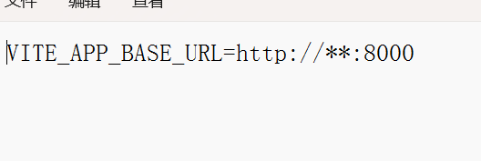

## lzBlog-frot_end

该项目为博客前台项目，实现了导航页，文章标签页，最新、最热文章的推荐，基于wangeditor二次开发的文章详情页等。

> 本项目使用的包管理工具为`pnpm`，需要先安装pnpm
>
> `npm install pnpm -g`

接下来，安装项目依赖，运行项目。

1、安装依赖

`pnpm install`

2、运行项目

`pnpm run dev`

项目打包

`pnpm run build`

打包部署时，需要将.env.production中的网络请求地址修改为自己服务器的接口地址。

